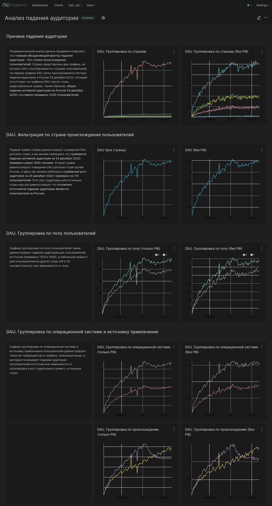
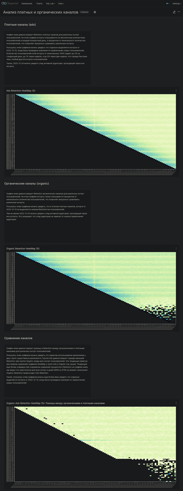
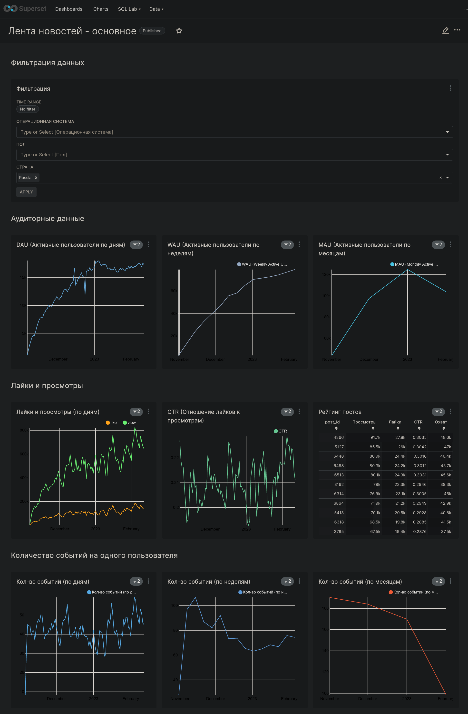
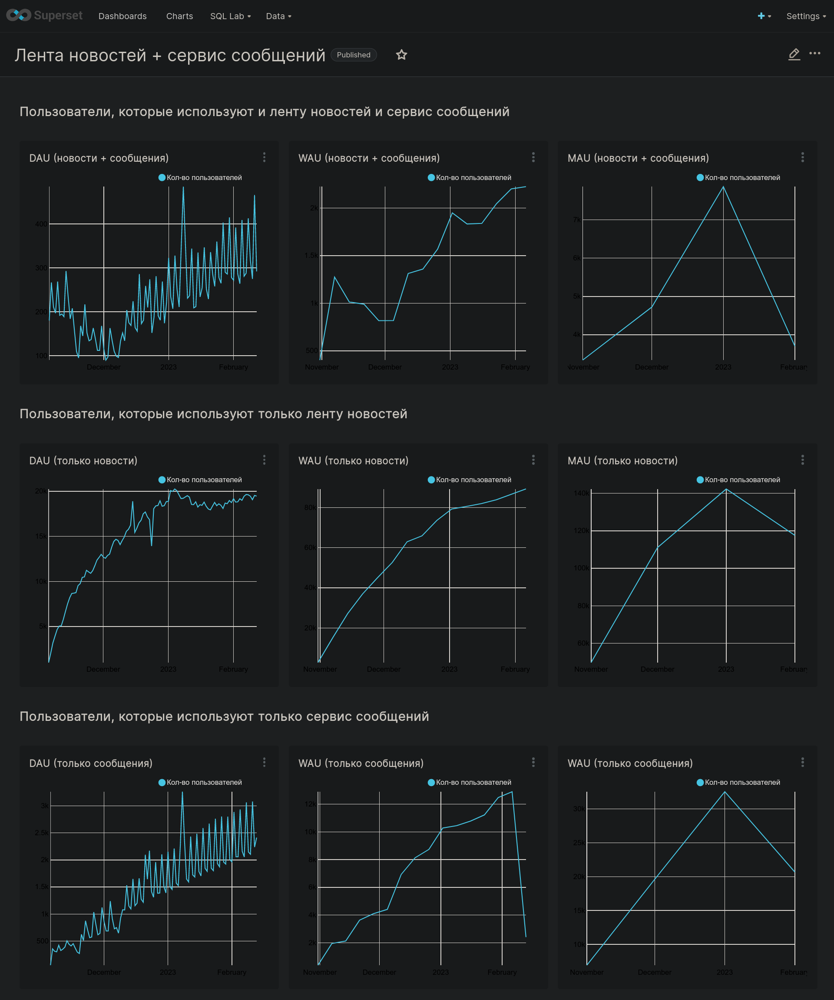

# Аналитические дашборы
Для анализа продукта, состоящего из ленты новостей и мессенджера,
были разработаны дашборды, которые освещают изучаемые продукты "с разных сторон".
Ниже представлены основные дашборды, которые изучают аномалии в поведении аудитории продукта,
и дашборды, которые изучают основные продуктовые метрики.

<h2 id="dashboard_01">Дашборд анализа причины аномального падения активной аудитории новостной ленты</h2>

<h2 id="dashboard_02">Дашборд сравнительного анализа поведения "органических" и "рекламных" пользователей</h2>

<h2 id="dashboard_03">Дашборд анализа базовых продуктовых метрик ленты новостей</h2>

<h2 id="dashboard_04">Дашборд анализа базовых продуктовых метрик ленты новостей и мессенджера</h2>

