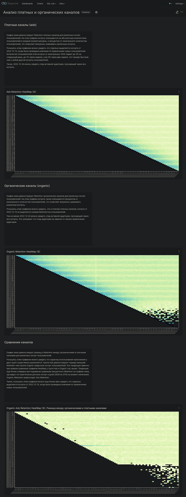
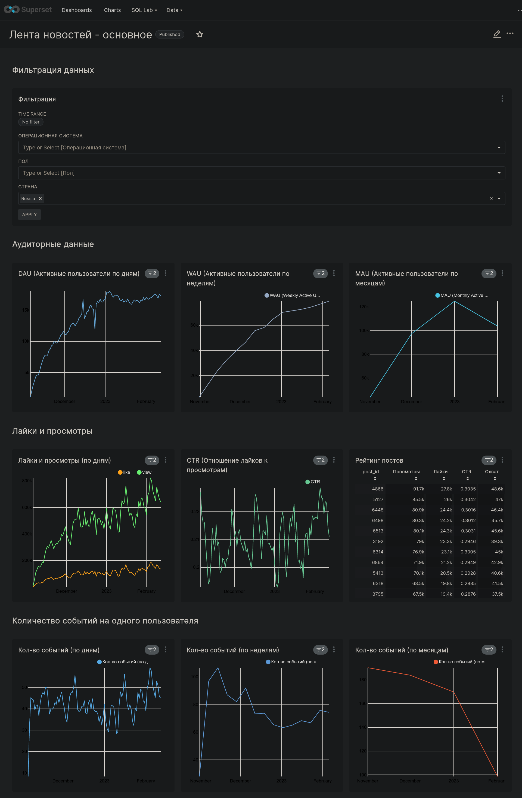
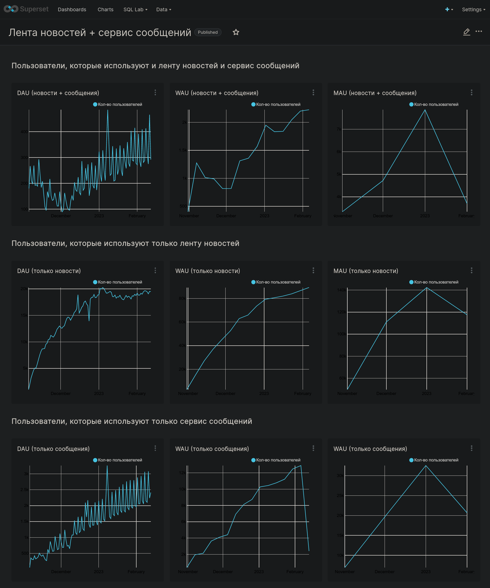

# Аналитические дашборы
Для анализа продукта, состоящего из ленты новостей и мессенджера,
были разработаны дашборды, которые освещают изучаемые продукты "с разных сторон".
Ниже представлены основные дашборды, которые изучают аномалии в поведении аудитории продукта,
и дашборды, которые изучают основные продуктовые метрики.

## Анализ аномального падения аудитории

## Анализ платных и органических каналов

## Анализ базовых продуктовых метрик ленты новостей

## Анализ базовых продуктовых метрик ленты новостей и мессенджера

